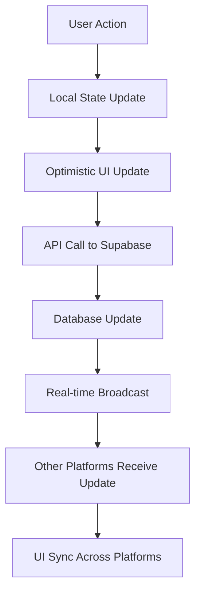

# 🎯 HealthyThako Seamless User Experience Requirements

## 🌟 Core Principles

### **Unified Identity**
- Single sign-on across all platforms
- Consistent user profiles and preferences
- Synchronized authentication state
- Shared user settings and configurations

### **Data Continuity**
- Real-time synchronization across platforms
- Persistent state management
- Cross-platform action completion
- Unified transaction history

### **Consistent Experience**
- Uniform design language and UI patterns
- Standardized user flows and interactions
- Consistent terminology and messaging
- Aligned feature sets where applicable

## 🔧 Technical Requirements

### **1. Authentication & User Management**

#### **Current Implementation** ✅
- Supabase Auth with unified user table
- Role-based access control (client, trainer, gym_owner, admin)
- Row Level Security (RLS) policies
- Session management across platforms

#### **Required Enhancements** 🚧
```typescript
// Enhanced user profile synchronization
interface UnifiedUserProfile {
  id: string;
  email: string;
  full_name: string;
  user_type: 'client' | 'trainer' | 'gym_owner' | 'admin';
  preferences: {
    notifications: NotificationSettings;
    privacy: PrivacySettings;
    language: string;
    timezone: string;
  };
  cross_platform_state: {
    last_active_platform: 'mobile' | 'trainer_app' | 'website';
    active_sessions: PlatformSession[];
    synchronized_at: timestamp;
  };
}
```

#### **Implementation Tasks**
- [ ] Implement cross-platform session validation
- [ ] Add user preference synchronization
- [ ] Create unified profile management API
- [ ] Implement automatic session refresh

### **2. Real-time Data Synchronization**

#### **Current Implementation** ✅
- Supabase Realtime for database changes
- Shared database across all platforms
- Real-time booking updates

#### **Required Enhancements** 🚧
```typescript
// Enhanced real-time synchronization
interface SyncManager {
  subscribeToUserData(userId: string): Subscription;
  syncBookingState(bookingId: string): Promise<void>;
  syncPaymentStatus(transactionId: string): Promise<void>;
  syncConversations(userId: string): Promise<void>;
  handleConflictResolution(conflict: DataConflict): Promise<void>;
}
```

#### **Implementation Tasks**
- [ ] Implement optimistic updates with rollback
- [ ] Add conflict resolution for concurrent edits
- [ ] Create data synchronization health monitoring
- [ ] Implement offline-first architecture with sync

### **3. Cross-Platform Navigation & Deep Linking**

#### **Current Implementation** ✅
- Basic deep linking for payment flows
- URL-based navigation on website

#### **Required Enhancements** 🚧
```typescript
// Universal deep linking system
interface DeepLinkManager {
  generateUniversalLink(action: string, params: object): string;
  handleIncomingLink(link: string): NavigationAction;
  createCrossPlatformRedirect(source: Platform, target: Platform): string;
  trackLinkUsage(link: string, platform: Platform): void;
}

// Example universal links
// healthythako://trainer/123 -> Opens trainer profile on any platform
// healthythako://booking/456 -> Opens booking details
// healthythako://chat/789 -> Opens conversation
```

#### **Implementation Tasks**
- [ ] Implement universal link schema
- [ ] Add cross-platform navigation handlers
- [ ] Create link generation utilities
- [ ] Implement fallback mechanisms

### **4. Unified Communication System**

#### **Current Implementation** ✅
- Basic messaging tables in database
- Notification system structure

#### **Required Enhancements** 🚧
```typescript
// Cross-platform messaging
interface UnifiedMessaging {
  sendMessage(conversationId: string, message: Message): Promise<void>;
  syncConversations(userId: string): Promise<Conversation[]>;
  markAsRead(messageId: string, platform: Platform): Promise<void>;
  getUnreadCount(userId: string): Promise<number>;
  subscribeToMessages(conversationId: string): Subscription;
}

// Cross-platform notifications
interface NotificationManager {
  sendPushNotification(userId: string, notification: Notification): Promise<void>;
  syncNotificationPreferences(userId: string): Promise<void>;
  markNotificationAsRead(notificationId: string): Promise<void>;
  getNotificationHistory(userId: string): Promise<Notification[]>;
}
```

#### **Implementation Tasks**
- [ ] Implement real-time messaging synchronization
- [ ] Add push notification coordination
- [ ] Create unified notification preferences
- [ ] Implement message delivery confirmation

### **5. Payment & Transaction Continuity**

#### **Current Implementation** ✅
- UddoktaPay integration
- Transaction recording in database
- Payment redirect handling

#### **Required Enhancements** 🚧
```typescript
// Cross-platform payment state
interface PaymentManager {
  initiatePayment(amount: number, purpose: string, platform: Platform): Promise<PaymentSession>;
  resumePayment(sessionId: string, platform: Platform): Promise<PaymentSession>;
  syncPaymentStatus(transactionId: string): Promise<TransactionStatus>;
  handlePaymentCallback(callback: PaymentCallback): Promise<void>;
  getPaymentHistory(userId: string): Promise<Transaction[]>;
}
```

#### **Implementation Tasks**
- [ ] Implement payment session persistence
- [ ] Add cross-platform payment resumption
- [ ] Create payment status synchronization
- [ ] Implement payment failure recovery

### **6. Shared Shopping Cart & Bookings**

#### **Current Implementation** ✅
- Booking system in database
- Basic booking management

#### **Required Enhancements** 🚧
```typescript
// Cross-platform cart and booking state
interface BookingManager {
  addToCart(item: BookingItem, platform: Platform): Promise<void>;
  syncCart(userId: string): Promise<CartItem[]>;
  initiateBooking(cartItems: CartItem[]): Promise<Booking>;
  resumeBooking(bookingId: string, platform: Platform): Promise<Booking>;
  syncBookingStatus(bookingId: string): Promise<BookingStatus>;
}
```

#### **Implementation Tasks**
- [ ] Implement persistent shopping cart
- [ ] Add cross-platform cart synchronization
- [ ] Create booking state management
- [ ] Implement booking conflict resolution

## 📱 Platform-Specific Requirements

### **Mobile App Requirements**
- [ ] Implement background sync for offline usage
- [ ] Add push notification handling
- [ ] Create deep link handlers for all universal links
- [ ] Implement biometric authentication
- [ ] Add offline-first data caching

### **Trainer App Requirements**
- [ ] Real-time client booking notifications
- [ ] Cross-platform earnings synchronization
- [ ] Unified client communication interface
- [ ] Schedule synchronization across platforms
- [ ] Performance analytics dashboard

### **Website Requirements**
- [ ] Progressive Web App (PWA) capabilities
- [ ] Cross-platform authentication state
- [ ] Universal link generation and handling
- [ ] Real-time updates without page refresh
- [ ] Mobile-responsive design consistency

## 🔄 Data Flow Architecture

### **Synchronization Patterns**


### **Conflict Resolution Strategy**
1. **Last Write Wins**: For user preferences and settings
2. **Operational Transform**: For collaborative editing
3. **Manual Resolution**: For critical business data
4. **Automatic Merge**: For non-conflicting changes

## 🎯 User Experience Goals

### **Seamless Transitions**
- Start booking on mobile, complete on website
- Begin conversation on trainer app, continue on mobile
- Save preferences on one platform, apply everywhere
- Maintain authentication across platform switches

### **Consistent Information**
- Unified trainer profiles and ratings
- Synchronized availability and schedules
- Consistent pricing and promotions
- Aligned gym information and amenities

### **Intelligent Recommendations**
- Cross-platform behavior analysis
- Unified recommendation engine
- Personalized content delivery
- Smart notification timing

## 📊 Success Metrics

### **Technical Metrics**
- Cross-platform sync latency < 2 seconds
- Data consistency rate > 99.9%
- Authentication success rate > 99.5%
- Deep link success rate > 95%

### **User Experience Metrics**
- Cross-platform user retention rate
- Session handoff success rate
- User satisfaction scores
- Feature adoption across platforms

### **Business Metrics**
- Cross-platform conversion rates
- Revenue attribution across platforms
- User lifetime value increase
- Platform switching frequency

## 🚀 Implementation Roadmap

### **Phase 1: Foundation** (4 weeks)
- [ ] Enhanced authentication system
- [ ] Basic real-time synchronization
- [ ] Universal deep linking schema
- [ ] Cross-platform user profiles

### **Phase 2: Core Features** (6 weeks)
- [ ] Unified messaging system
- [ ] Cross-platform payment flows
- [ ] Shared booking management
- [ ] Real-time notifications

### **Phase 3: Advanced Features** (8 weeks)
- [ ] Offline-first architecture
- [ ] Advanced conflict resolution
- [ ] Intelligent recommendations
- [ ] Performance optimization

### **Phase 4: Polish & Scale** (4 weeks)
- [ ] User experience testing
- [ ] Performance monitoring
- [ ] Security auditing
- [ ] Documentation and training

---

## 🔗 Related Documents

- [HealthyThako Ecosystem Documentation](./HEALTHYTHAKO_ECOSYSTEM_DOCUMENTATION.md)
- [API Documentation](./API_DOCUMENTATION.md)
- [Database Schema](./DATABASE_SCHEMA.md)
- [Security Guidelines](./SECURITY_GUIDELINES.md)

---

*Last Updated: January 2025*
*Priority: High*
*Status: Planning Phase*
